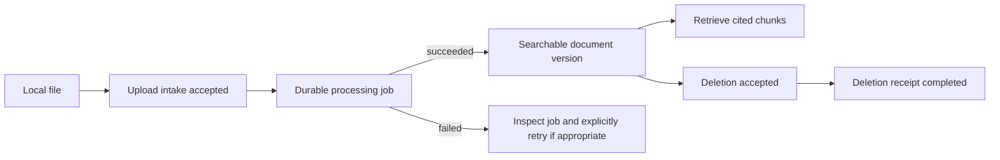

# Document lifecycle

An upload is accepted before processing finishes. A successful `documents.upload()` returns durable IDs for the intake, document, version, and processing job. It does not mean the document is searchable. Use `jobs.wait()` or `documents.upload_and_wait()` when the application needs to wait for processing.

`jobs.wait(job_id, timeout=300)` observes a job until it succeeds or reaches a terminal failure. A timeout only stops the SDK's local wait; it does not cancel remote work. Keep the accepted IDs, inspect the job, and resume waiting if needed. The SDK never retries a failed job or cancels it on your behalf.

Deleting a document also has a durable lifecycle. `documents.delete(document_id)` returns a deletion receipt. Call `deletions.wait(receipt.id)` to observe completion. A completed receipt is the operation's result; an accepted delete command is not completion.

The [upload guide](../guides/upload-and-sync.md), [error recovery guide](../guides/errors-and-recovery.md), and [client reference](../reference/client-and-resources.md) show the relevant calls.
