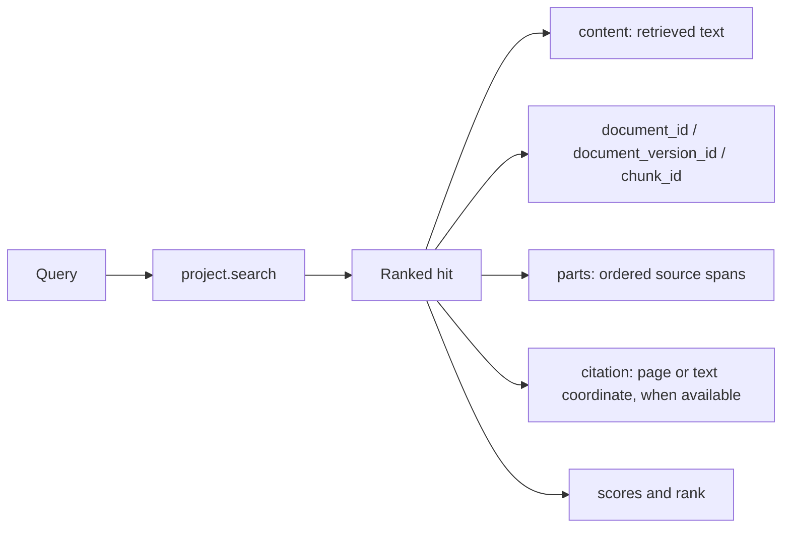

# Retrieval results and citations

`project.search()` returns ranked chunks with source provenance. It does not generate an answer. Your application can display the chunks, use them as evidence, or pass them to a separate answer-generation system.

Each result item includes `source_filename`, `content`, stable document/version/chunk IDs, ordered `parts`, `rank`, and scores. `citation` can be `None`; preserve `parts` rather than inventing a page number. PDF citations may use a page and offsets; text and Markdown use typed source coordinates. The complete result also has `retrieval_id` and `retrieval_version`.

Use `SearchFilters` to narrow results by document ID or supported metadata. `k` bounds how many chunks you request. Optional reranking changes ranking and score interpretation; see [reranking](../guides/reranking.md). Search is metered and is never automatically replayed by the SDK.

For code, see [search and filters](../guides/search-and-filter.md). For the response shape, see [clients and resources](../reference/client-and-resources.md).
